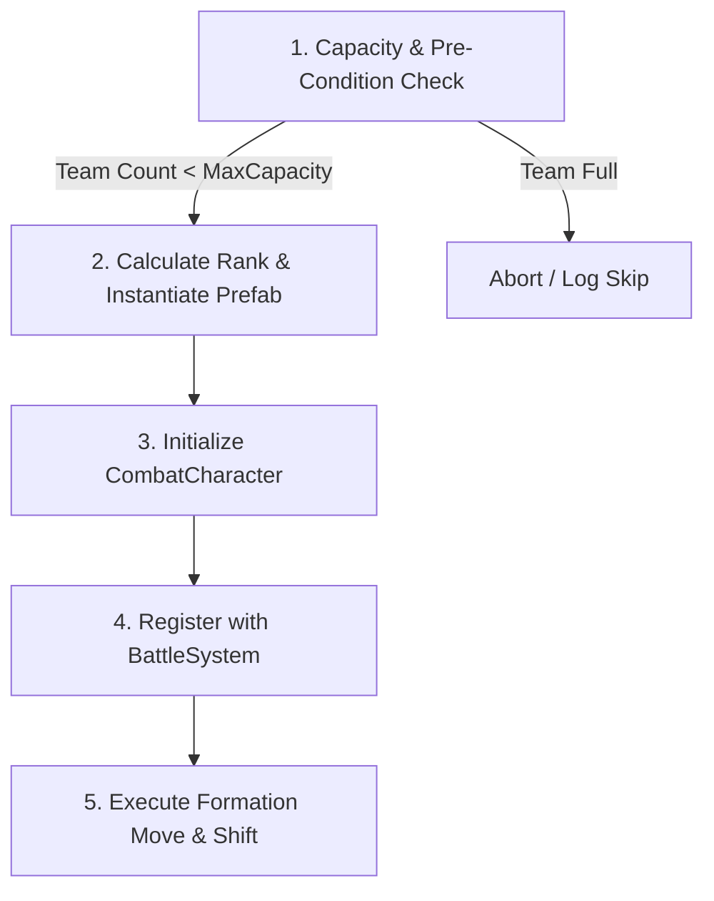

# Mid-Combat Summoning Mechanic

Owner: Combat Engineering Team
Status: active
Last verified: 2026-10-08
Verified commit: HEAD
Target build: Unity 2022.3 + Windows

## Purpose
The Mid-Combat Summoning mechanic provides a generalized architecture for dynamically instantiating and integrating new combatants into active battles. It supports player skills, enemy boss abilities, modular `ISkillEffect` assets, and reactive status/trait triggers. The system guarantees formation integrity, calculates spatial rank coordinates, initializes stats and AI brains, and updates battle lifecycle tracking mid-combat.

## Scope
- In scope: Modular `ISkillEffect` implementation, controller-level event interception, reactive status/trait triggers, capacity checks, spatial rank calculation, prefab instantiation and orientation, combatant initialization, lifecycle registration, and formation rank shifting.
- Out of scope: Specific visual particle effects, audio asset authoring, or persistent party recruitment outside of combat encounters.

## Source of Truth
- Code:
  - `Assets/Scripts/Combat/BattleSystem.cs`: Core battle engine exposing `RegisterSpawnedCharacter()`, `ExecuteMoveAndShift()`, `GetXPositionForRank()`, `PlayerTeam`, and `EnemyTeam`.
  - `Assets/Scripts/Combat/CharacterLifecycleManager.cs`: Handles dynamic registration, event subscription (`OnDefeated`, `OnStateChanged`), trait activation, and `OnCharacterSpawned` invocation.
  - `Assets/Scripts/Combat/CombatCharacter.cs`: Defines `InitializeForCombat(Team, rank)` setting up stats, HP, skills, and AI brain components.
  - `Assets/Scripts/Combat/GodEyeController.cs`: Boss controller pattern intercepting `OnActionResolved` for dynamic mid-combat summons.
  - `Assets/Scripts/Combat/RoseKnightController.cs`: Secondary controller pattern intercepting action resolution for mid-combat allies.
  - `Assets/Scripts/Combat/AI/Nodes/GodEyeTurnBehaviorNode.cs`: AI node pattern evaluating team capacity before queuing summon skills.
- Tests:
  - `Assets/Editor/Tests/GodEyeAITests.cs`: Automated unit tests verifying mid-combat summoning, prefab selection, and formation shifting.

## Inputs
- Summon Trigger: Executed via modular `ISkillEffect`, skill resolution event (`OnActionResolved`), status effect tick, or character trait event.
- Parameters:
  - `allyPrefab` (`GameObject`): Prefab containing a `CombatCharacter` component to instantiate.
  - `targetTeam` (`Team`): Team allegiance (`Team.Player` or `Team.Enemy`).
  - `targetRank` (`int`): Desired rank position (1 = front rank). Optional; if omitted, appends to the back of the formation.
  - `maxTeamSize` (`int`): Maximum allowed alive members for the target team (default: 4).

## State Model
States:
- `Inactive`: Skill or trigger condition is pending.
- `Triggered`: Skill effect executes or action resolution event fires.
- `CapacityChecked`: System verifies that the target team has available capacity (`team.Count(c => c.IsAlive) < maxTeamSize`).
- `Instantiated`: Prefab instantiated at calculated spatial coordinates (`Vector3(xPos, 0, 0)`) with team-appropriate scale facing (`+x` for Player, `-x` for Enemy).
- `Initialized`: `CombatCharacter.InitializeForCombat(team, spawnRank)` configures stats, HP, skill lists, and AI brain components.
- `Registered`: `BattleSystem.RegisterSpawnedCharacter()` adds the character to the active team list, subscribes defeat events, activates traits, and fires `OnCharacterSpawned`.
- `Shifted`: `BattleSystem.ExecuteMoveAndShift()` repositions the character to the target rank, pushing existing units backward to maintain formation ordering.

Transitions:
1. `Inactive` -> `Triggered` when a summon skill is used or a reactive trigger condition is met.
2. `Triggered` -> `CapacityChecked` when team capacity is evaluated against `maxTeamSize`.
3. `CapacityChecked` -> `Instantiated` when `team.Count < maxTeamSize` passes and GameObject instantiation completes.
4. `Instantiated` -> `Initialized` when `CombatCharacter.InitializeForCombat` executes.
5. `Initialized` -> `Registered` when `BattleSystem.RegisterSpawnedCharacter` runs.
6. `Registered` -> `Shifted` when `BattleSystem.ExecuteMoveAndShift` completes formation adjustments.

## Timing Model
- Update domain: Action execution phase or event callback domain.
- Tick rate: N/A (Event-driven / Action-step processing).
- Order dependencies:
  1. Capacity check must evaluate before instantiating prefabs.
  2. `CombatCharacter.InitializeForCombat` must complete before `RegisterSpawnedCharacter`.
  3. `RegisterSpawnedCharacter` must add the unit to the team list before `ExecuteMoveAndShift` runs.
  4. All spawn and shift steps run synchronously within the current action resolution block before turn advancement.

## Determinism
- Deterministic across clients: Yes.
- Sources of nondeterminism: None in core spawning, rank calculation, or shifting.
- Mitigation: Seeded RNG used for any conditional prefab selection logic.

## Formulas
```txt
# Appended Spawn Rank (Back of formation)
maxOccupied = Max(c.OccupiedRanks.Max() or c.rank) for c in TargetTeam
spawnRank = (TargetTeam.Count > 0) ? maxOccupied + 1 : 1

# World X Position Calculation
xPosition = FormationManager.GetXPositionForRank(targetTeam, spawnRank)
spawnPosition = Vector3(xPosition, 0, 0)

# Local Scale Orientation (Facing)
facingDirection = (targetTeam == Team.Player) ? +Abs(scaleX) : -Abs(scaleX)
transform.localScale = Vector3(facingDirection, scaleY, scaleZ)

# Rank Shifting (Insertion at target rank)
ExecuteMoveAndShift(spawnedCharacter, targetRank)
```

## Tuning Variables
| Variable | Default | Min | Max | Unit | Source |
| --- | --- | --- | --- | --- | --- |
| `maxTeamSize` | 4 | 1 | 4 | count | Skill / Controller Data |
| `targetRank` | -1 (Back) | 1 | 4 | rank | Skill / Controller Data |
| `allyPrefab` | `GameObject` | N/A | N/A | Prefab | Skill / Controller Data |

---

## Implementation Architecture & Integration Patterns

Project Nevergreen supports three integration patterns for mid-combat summoning:

### Pattern A: Modular Skill Effect (`ISkillEffect`)
Use this pattern for standard player or enemy skills authored as `ScriptableObject` skill effects attached to `SkillData.effects`.

```csharp
using System;
using System.Linq;
using UnityEngine;
using Nevergreen.Data;

namespace Nevergreen.Combat
{
    /// <summary>
    /// Modular skill effect that summons an ally mid-combat.
    /// Can be attached to any SkillData asset.
    /// </summary>
    [Serializable]
    public class SummonAllyEffect : ISkillEffect
    {
        [Tooltip("Prefab of the combat character to summon.")]
        public GameObject allyPrefab;

        [Tooltip("Target rank to insert the summoned ally (1 = front rank). Set to -1 to append to back.")]
        public int targetRank = -1;

        [Tooltip("Maximum allowed size of the target team. If team capacity is full, summoning is skipped.")]
        public int maxTeamSize = 4;

        public void Execute(SkillContext context, CombatCharacter target)
        {
            var battle = context.battleSystem;
            if (battle == null || allyPrefab == null) return;

            var user = context.user;
            var team = user.IsPlayerTeam ? battle.PlayerTeam : battle.EnemyTeam;
            var teamType = user.team;

            // Step 1: Capacity & Pre-condition Check
            int aliveCount = team.Count(c => c.IsAlive);
            if (aliveCount >= maxTeamSize)
            {
                Debug.Log($"[SummonAllyEffect] Summon skipped: {teamType} team is at max capacity ({maxTeamSize}).");
                return;
            }

            // Step 2: Calculate Spawn Rank & Instantiate
            int maxOccupied = team.Count > 0 
                ? team.Max(c => c.OccupiedRanks.Count > 0 ? c.OccupiedRanks.Max() : c.rank) 
                : 0;
            int spawnRank = maxOccupied + 1;

            float xPos = battle.GetXPositionForRank(teamType, spawnRank);
            Vector3 spawnPos = new Vector3(xPos, 0f, 0f);
            GameObject allyGO = UnityEngine.Object.Instantiate(allyPrefab, spawnPos, Quaternion.identity);

            // Orient facing direction
            float originalX = Mathf.Abs(allyGO.transform.localScale.x);
            float facingX = (teamType == Team.Player) ? originalX : -originalX;
            allyGO.transform.localScale = new Vector3(facingX, allyGO.transform.localScale.y, allyGO.transform.localScale.z);

            // Step 3: Character Initialization
            CombatCharacter allyCombat = allyGO.GetComponent<CombatCharacter>();
            if (allyCombat == null)
            {
                Debug.LogError("[SummonAllyEffect] Spawned prefab is missing a CombatCharacter component.");
                if (Application.isPlaying) UnityEngine.Object.Destroy(allyGO);
                else UnityEngine.Object.DestroyImmediate(allyGO);
                return;
            }

            allyCombat.InitializeForCombat(teamType, spawnRank);

            // Step 4: Battle System Registration
            battle.RegisterSpawnedCharacter(allyCombat);

            // Step 5: Formation Rank Shifting
            if (targetRank >= 1 && targetRank <= spawnRank)
            {
                battle.ExecuteMoveAndShift(allyCombat, targetRank);
            }

            Debug.Log($"[SummonAllyEffect] Successfully summoned '{allyCombat.DisplayName}' for {teamType} at rank {allyCombat.rank}.");
        }
    }
}
```

---

### Pattern B: Boss Controller Action Interception (`OnActionResolved`)
Use this pattern when summoning involves complex phase logic, dynamic prefab selection based on live team composition, or boss behavior scripting.

```csharp
public class BossSummonController : MonoBehaviour
{
    public SkillData summonSkill;
    public GameObject tankAllyPrefab;
    public GameObject damageAllyPrefab;
    public CharacterData tankData;

    private CombatCharacter _self;
    private BattleSystem _battleSystem;

    private void Awake()
    {
        _self = GetComponent<CombatCharacter>();
        _battleSystem = FindFirstObjectByType<BattleSystem>();
        if (_battleSystem != null)
        {
            _battleSystem.OnActionResolved += HandleActionResolved;
        }
    }

    private void OnDestroy()
    {
        if (_battleSystem != null)
        {
            _battleSystem.OnActionResolved -= HandleActionResolved;
        }
    }

    private void HandleActionResolved(CombatCharacter user, SkillData skill, SkillContext context)
    {
        if (user != _self || skill != summonSkill) return;

        // Capacity check
        if (_battleSystem.EnemyTeam.Count(c => c.IsAlive) >= 4) return;

        // Dynamic ally selection: spawn damage unit if tank exists, else spawn tank
        bool hasTank = _battleSystem.EnemyTeam.Any(c => 
            c.IsAlive && c.characterData.characterId == tankData.characterId
        );
        GameObject prefabToSpawn = hasTank ? damageAllyPrefab : tankAllyPrefab;

        SummonHelper.SpawnAndRegister(_battleSystem, Team.Enemy, prefabToSpawn, targetRank: _self.rank);
    }
}
```

---

### Pattern C: Reactive Status & Trait Triggers
Use this pattern for reactive summons triggered by character traits, status effect ticks, or death events (e.g. splitting enemies or minion spawns upon taking threshold damage).

```csharp
public class OnDeathSummonTrait : MonoBehaviour
{
    public GameObject minionPrefab;
    private CombatCharacter _self;
    private BattleSystem _battleSystem;

    private void Awake()
    {
        _self = GetComponent<CombatCharacter>();
        _battleSystem = FindFirstObjectByType<BattleSystem>();
        _self.OnDefeated += HandleDefeated;
    }

    private void OnDestroy()
    {
        if (_self != null) _self.OnDefeated -= HandleDefeated;
    }

    private void HandleDefeated(CombatCharacter character, bool wasCritical)
    {
        // Spawns minion upon defeat unless destroyed by a critical hit
        if (wasCritical || _battleSystem == null || minionPrefab == null) return;

        SummonHelper.SpawnAndRegister(_battleSystem, _self.team, minionPrefab, targetRank: _self.rank);
    }
}
```

---

## Universal 5-Step Implementation Pipeline

Every mid-combat summon implementation in Project Nevergreen must follow this 5-step pipeline:



1. **Capacity Check**:
   Evaluate `team.Count(c => c.IsAlive) < maxTeamSize`. Skip if team capacity is full.
2. **Calculate Rank & Instantiate**:
   Find `maxOccupied` rank, calculate `spawnRank = maxOccupied + 1`, compute `xPos` via `battleSystem.GetXPositionForRank()`, instantiate prefab, and adjust local scale facing.
3. **Initialize `CombatCharacter`**:
   Invoke `allyCombat.InitializeForCombat(teamType, spawnRank)` to set up stats, HP, skill lists, and AI brain components.
4. **Register with `BattleSystem`**:
   Invoke `battleSystem.RegisterSpawnedCharacter(allyCombat)` to add the character to the team list, subscribe lifecycle events, activate traits, and fire `OnCharacterSpawned`.
5. **Execute Formation Rank Shift**:
   If inserting at a target rank (e.g., front rank or user's rank), invoke `battleSystem.ExecuteMoveAndShift(allyCombat, targetRank)` to reposition units cleanly.

---

## Edge Cases
- Missing Prefab or `CombatCharacter`: Safely logs an error and immediately destroys the instantiated GameObject (`Destroy` in Play mode, `DestroyImmediate` in Edit mode).
- Full Team Capacity: Skill effects and AI nodes check `team.Count(c => c.IsAlive) < maxTeamSize` to avoid exceeding formation bounds.
- Multi-Rank Combatants: Spawn rank calculation evaluates `c.OccupiedRanks.Max()` to ensure large multi-rank units are respected when calculating append positions.
- Rank Shift Insertion: Inserting a unit at rank `R` using `ExecuteMoveAndShift` cleanly shifts the existing occupant of rank `R` and all higher-ranked combatants back by 1 rank.

## Failure Modes
- Null `BattleSystem`: Returns early or logs warning without throwing unhandled exceptions.
- Missing Prefab Reference: Aborts spawn step cleanly and logs diagnostic error.
- Invalid Target Rank: If `targetRank` exceeds `spawnRank`, insertion defaults to `spawnRank` without error.

## Event Hooks
- Event: `BattleSystem.OnActionResolved`, Trigger: Fired when skill execution completes in `SkillExecutor`, Payload: `(CombatCharacter user, SkillData skill, SkillContext context)`.
- Event: `CharacterLifecycleManager.OnCharacterSpawned`, Trigger: Fired upon successful registration via `RegisterSpawnedCharacter()`, Payload: `(CombatCharacter character)`.

## Acceptance Tests
- Automated:
  - `GodEyeAITests.Controller_SummonProtector_WhenNoneExists`: Verifies Protector ally spawns at rank 1 when no Protector is active.
  - `GodEyeAITests.Controller_SummonDamage_WhenProtectorExists`: Verifies Damage ally spawns when a Protector is already present.
  - `GodEyeAITests.TurnBehavior_Summons_WhenTeamHasLessThan4Members`: Verifies AI node selects summon skill when team size < 4.
  - `GodEyeAITests.TurnBehavior_RandomBuffOrMark_WhenTeamHas4Members`: Verifies AI switches to Buff/Mark when team size reaches 4.
- Playtest:
  - Verify summoned unit appears at correct visual position with correct team sprite orientation.
  - Verify existing units visually shift backward when an ally is inserted into an occupied rank.
  - Verify summoned unit appears in combat turn tracking and acts on subsequent turns.

## Missing Evidence
- None. System design and implementation patterns are fully grounded in codebase facts and verified unit tests.

## Validation
- [x] Facts match current code/content
- [x] Timing and determinism assumptions are explicit
- [x] Tuning variables map to actual data/config
- [x] Unknowns are explicitly labeled
- [x] Acceptance tests are defined
